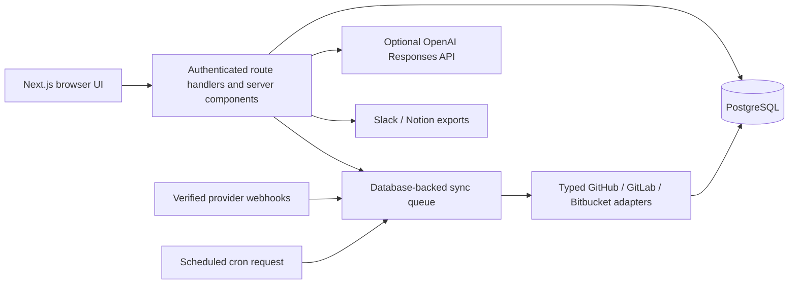

# DevDash

DevDash is a privacy-conscious engineering workspace that normalizes source-control activity, personal tasks, focus sessions, CI runs, and evidence-based operational insights. Pages read from PostgreSQL; provider crawls run as queued synchronization jobs rather than during rendering.

> The previously deployed [Vercel preview](https://dev-dash-woad.vercel.app) may not match this working tree until these changes are deployed and its environment is updated.

## Current capabilities

- GitHub identity sign-in with minimal `read:user user:email` scopes.
- Separate GitHub App repository installation using short-lived installation tokens.
- GitLab, Bitbucket, Slack, and Notion OAuth connect/callback flows with encrypted long-lived credentials.
- PostgreSQL-backed repositories, pull requests, pipelines, activity, tasks, focus sessions, calendar records, notifications, settings, sync jobs, exports, and AI reports.
- Manual, scheduled, and webhook-triggered sync queues with pagination, retry/backoff, rate-limit classification, and retained last-known-good data.
- Dedicated routes for overview, timeline, repositories, pull requests, pipelines, analytics, developer health, AI brief, focus, tasks, calendar, integrations, notifications, settings, and privacy.
- Deterministic AI fallback, AI opt-in, private-repository redaction, account export, and cascade deletion.

The marketing preview is explicitly illustrative. Authenticated metrics are calculated only from stored records.

## Architecture



Decisions are recorded in [`docs/adr`](docs/adr). Provider tokens are never passed to client components. GitHub installation tokens are generated on demand and are not stored; other provider credentials are encrypted with AES-256-GCM.

## Stack

Next.js 16, React 19, TypeScript, Tailwind CSS, Auth.js/NextAuth, Prisma 7, PostgreSQL, Zod, Vitest, and Playwright.

## Local setup

Requirements: Node.js 22+, npm, and Docker Desktop (or another PostgreSQL 17 instance).

```bash
cp .env.example .env
docker compose up -d postgres
npm ci
npm run db:deploy
npm run db:seed
npm run dev
```

Open `http://localhost:3000`. The seed is deterministic and creates records for `demo@devdash.local`; it does not create an authentication bypass. The test-only session route is available solely when `E2E_TEST_MODE=1` and never in a production build.

## Environment variables

| Name                                                                         | Required       | Purpose                                              |
| ---------------------------------------------------------------------------- | -------------- | ---------------------------------------------------- |
| `DATABASE_URL`                                                               | Yes            | PostgreSQL connection string                         |
| `NEXTAUTH_URL`                                                               | Yes            | Canonical application origin and OAuth callback base |
| `NEXTAUTH_SECRET`                                                            | Yes            | Session and signed OAuth-state secret                |
| `GITHUB_ID`, `GITHUB_SECRET`                                                 | Sign-in        | Minimal identity OAuth app                           |
| `GITHUB_APP_ID`, `GITHUB_APP_SLUG`, `GITHUB_APP_PRIVATE_KEY`                 | GitHub data    | GitHub App installation authentication               |
| `GITHUB_WEBHOOK_SECRET`                                                      | GitHub webhook | HMAC verification                                    |
| `CREDENTIAL_ENCRYPTION_KEY`                                                  | Provider OAuth | Server-only credential encryption                    |
| `GITLAB_CLIENT_ID`, `GITLAB_CLIENT_SECRET`, `GITLAB_WEBHOOK_SECRET`          | GitLab         | OAuth and verified webhooks                          |
| `BITBUCKET_CLIENT_ID`, `BITBUCKET_CLIENT_SECRET`, `BITBUCKET_WEBHOOK_SECRET` | Bitbucket      | OAuth and signed webhooks                            |
| `SLACK_CLIENT_ID`, `SLACK_CLIENT_SECRET`                                     | Slack          | OAuth export integration                             |
| `NOTION_CLIENT_ID`, `NOTION_CLIENT_SECRET`                                   | Notion         | OAuth export integration                             |
| `OPENAI_API_KEY`                                                             | Optional       | Opt-in AI brief generation                           |
| `CRON_SECRET`                                                                | Scheduled sync | Protects the cron endpoint                           |

Never commit `.env` or real keys. Generate the two application secrets with `openssl rand -base64 32`.

## Provider setup

### GitHub

Create an OAuth App for identity only. Use `${NEXTAUTH_URL}` as its homepage and `${NEXTAUTH_URL}/api/auth/callback/github` as its callback.

Create a separate GitHub App for repository data. Set its setup URL to `${NEXTAUTH_URL}/api/integrations/github/callback` and webhook URL to `${NEXTAUTH_URL}/api/webhooks/github`. Grant read-only repository metadata, contents, pull requests, issues, checks, actions, and commit statuses. Subscribe only to the events that should queue refreshes. Install it on selected personal or organization repositories, then copy the app ID, slug, private key, and webhook secret into the environment.

### GitLab and Bitbucket

Register OAuth applications with these callbacks:

- `${NEXTAUTH_URL}/api/integrations/gitlab/callback`
- `${NEXTAUTH_URL}/api/integrations/bitbucket/callback`

GitLab requests `read_api`; configure its webhook at `${NEXTAUTH_URL}/api/webhooks/gitlab`. Configure a Bitbucket consumer with repository, pull-request, issue, and pipeline read scopes and its webhook at `${NEXTAUTH_URL}/api/webhooks/bitbucket`. No provider write scope is requested by DevDash.

### Slack and Notion

Register callbacks at `${NEXTAUTH_URL}/api/integrations/slack/callback` and `${NEXTAUTH_URL}/api/integrations/notion/callback`. Slack requests `chat:write,channels:read`; Notion access is restricted by the pages the user authorizes.

## Database and migrations

There is one canonical PostgreSQL schema at `prisma/schema.prisma`.

```bash
npm run prisma:validate
npm run db:migrate -- --name describe_change
npm run db:deploy
```

Create migrations with `db:migrate` during development. Deploy immutable checked-in migrations with `db:deploy`; do not use `db push` in production.

## Validation

```bash
npm run format:check
npm run lint
npm run typecheck
npm run test
npm run test:coverage
RUN_DB_TESTS=1 npm run test:integration
npm run test:e2e
npm run prisma:validate
npm run build
npm audit --audit-level=high
npm run metrics
```

Integration and end-to-end tests require a migrated PostgreSQL database. Provider contract tests use deterministic mocked responses and never need live tokens. Live OAuth callbacks still require provider-owned test applications and cannot be verified from a clean checkout.

## Deployment

For Vercel, attach a PostgreSQL database, add production environment variables, and use `npm run vercel-build`. Set `NEXTAUTH_URL` to the final HTTPS origin before registering callback URLs. Schedule `GET /api/cron/sync` with `Authorization: Bearer $CRON_SECRET`. Apply migrations before serving traffic and configure `/api/health` for liveness and `/api/ready` for database readiness.

## Security and privacy

- Every user-data query includes the authenticated owner ID.
- Provider credentials are encrypted at rest; webhook signatures and delivery replay IDs are verified.
- Security headers include CSP, frame, content-type, referrer, permissions, and HSTS policies.
- AI is disabled by default. Only minimized event type, timestamp, and a truncated title are eligible; private records are excluded when the privacy setting is enabled.
- Account export returns the signed-in user's records. Account deletion cascades through all owned records and clears the session cookie.
- Public health output contains no integration configuration details.

Report vulnerabilities privately according to [SECURITY.md](SECURITY.md).

## Developer-health methodology

The score is an operational signal, never an individual productivity grade. It requires at least three delivery, review, CI, or work-in-progress observations. Components and weights are:

- Delivery flow (25%): median lead time; raw commit count is excluded.
- Review responsiveness (20%): median review turnaround.
- CI stability (25%): completed pipeline success rate.
- Work in progress (15%): share of open pull requests that are stale.
- Focus signal (15%): persisted focus minutes minus an explicitly estimated context-switch cost.

Each component is clamped to 0–100 and displayed with its explanation. Confidence is limited below ten observations. See `lib/scoring/health.ts` and its unit tests for the executable formula.

## Known limitations and roadmap

- Live provider callback verification requires credentials owned by the deployer.
- GitHub commit status and Checks API data are combined. GitLab and Bitbucket pipeline runs are synchronized, but their per-job/step detail is not yet normalized.
- Requested and completed review records are normalized where each provider exposes them; provider-specific dismissal and approval timestamps can be absent.
- Bitbucket does not expose a general-purpose token-revocation endpoint for this OAuth flow, so disconnect deletes the encrypted local credential and users should also revoke the consumer in Bitbucket account settings when immediate provider-side invalidation is required.
- Local database/E2E execution requires Docker, which is not bundled with this repository.
- Global search returns pages and stored repository, PR, issue, commit, task, and activity records; result links currently open their collection page rather than a detail route.

## Contributing

See [CONTRIBUTING.md](CONTRIBUTING.md). DevDash is available under the [MIT License](LICENSE).
